# Mildew Detector Cherry Leaves

Powdery Mildew Detector is an app that can predict whether a cherry leaf is healthy or is infected
with powdery mildew.
The app is capable of predicting on new image data of a given cherry leaf is healthy or infected.

The project aim is to create a **Predictive Analytics Machine Learning Tool** that can rapidly and accurately determine whteher an uploaded image of a cherry leaf is a healthy leaf, or one infected with the Powdery Mildew Disease, which is harmful to plants. The prupose of this is to aid the client in limiting their losses as a busienss that relies heavily on cherry leaves as a product for revenue.

The app has been designed using an ML model based on a supervised learning and single-label binary classification.
A binary classifer output is used to predict the outcome of data uploaded to the app.

:leaves: [View the live project here](https://mildew-detector-cherry-leaves-7ca9c643cfca.herokuapp.com/)

---

## Dataset Content

* The source of the dataset is [Kaggle](https://www.kaggle.com/codeinstitute/cherry-leaves). For this project, fictitious user stories and business requirements where predictive analytics can be applied to a real-world workplace project or situation.
* The dataset contains more than 4000 images taken from the client's crop fields. The images show healthy cherry leaves and cherry leaves that have powdery mildew.
* The cherry plantation crop is one of the finest products in their portfolio. Infected cherry leaves contain powdery mildew, which is a fungal disease that affects a wide range of plants. This presents a major problem to the busiess as the disease can severely compromise the product quality and output.

The full dataset can be found [here](https://www.kaggle.com/datasets/codeinstitute/cherry-leaves).

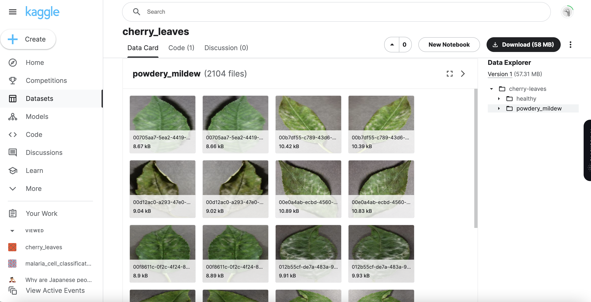

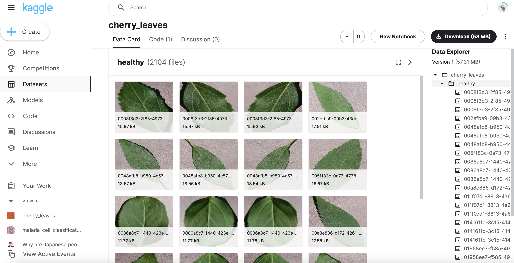

## Business Requirements

- Farmy & Foods is facing a challenge in their main plantation, where their cherry crops have been presenting powdery mildew. Currently, the process is manual verification if a given cherry tree contains powdery mildew. An employee can spend around 30 minutes in each tree, taking a few samples of tree leaves and verifying visually if the leaf tree is healthy or has powdery mildew. If there is powdery mildew, the employee must apply a specific compound to kill the fungus. The time spent applying this compound is 1 minute. The company has thousands of cherry trees, located on multiple farms across the country. As a result, this manual process is not scalable due to the time spent in the manual process inspection.

- To increase efficiency in this process, the IT team suggested an ML system that detects instantly, using a leaf tree image, if it is healthy or has powdery mildew. A similar manual process is in place for other crops for detecting pests, and if this initiative is successful, there is a realistic opportunity to replicate this project for all other crops to further improve business processes. 
- The dataset is a collection of cherry leaf images provided by the client, taken from their crops.

**Therefore, the client is interested in developing an app that has the capability to:**

* 1 - Visually differentiate a healthy cherry leaf from one with powdery mildew.
* 2 - Predict if a cherry leaf is healthy or contains powdery mildew.

## Hypotheses and Validation

1. Cherry leaves that are infected with powdery mildew have white spots or areas on the leaf surface, or plant stems.
2. The infection of powdery mildew would gradually spread, to eventually cover the plant to have a white powdery/fuzzy appearance all over.
3. This appearance of an infected plant should be a sufficient difference from a healthy leaf, to be able to trian an ML model to detect and predict the presence of powdery mildew on new leaf image data. This can help the client decrease time and labour costs associated with manual detection.
4. The ML model will be able to distinush between a healthy cherry leaf, and one which has been infected with powdery mildew, with an **accuracy of at least 97%.**

## Rationale to map the business requirements to the Data Visualisations and ML tasks

### Business Requirement 1: Data Visualisation
  
- The client wants to display the mean and variability of healthy cherry leaf images and cherry leaves that contain powdery mildew infection, so that they can visually differentiate between the two.
- The client wants to visually display the difference between an average healthy cherry leaf, and an average powdery mildew infected cherry leaf. This allows detection of distinguishable variations between the two. 
- The client would like an image montage to be available for healthy leaf images, and infected leaf images. This is to allow for a visual differentiation between the two image labels, and to recognise appearance patterns across images of the same label. 

### Business Requirement 2: Classification of Images

- The client requires a tool that accurately predicts whether a given cherry leaf is healthy or infected with powdery mildew disease.
- The company needs a data processing and prediction tool that can be assimilated across the company. This will eliminate need for manual detection of the infection which requires employee time and increased personnel resources.
- The company will save time and labour resources, as well as capital spent on these, by increasing the volume of product they can export and provide to the market. This will in turn increase their revenue and therefore provide the company with greater funds to invest in its own productivity and actvitiy.  
- The client wants an ML model with a binary classification output, and to have the ability to generate and download a report of the results.

## ML Business Case

1. The business objective means this project must devise a means to predict with accuracy and efficiency if a leaf is healthy or infected with powdery mildew disease.
2. Manual detection of powdery mildew takes around 30 minutes per tree, thus is time consuming and not scalable across the business. The ML model provides a more rapid and reliable method of diagnosing leaves. Thereby saving time and money for the client.
3. The ML tool can take both healthy and infected cherry leaves. It must predict with at least 97% accuracy if the given leaves are heathy or infected. This will ultimately benefit the client hugely if achieved.
4. The employees of the client can take images taken of cherry leaves in their plantations, and upload them to the app. The app can determine whether the leaf is infected with powdery mildew or is healthy rapidly, hugely reducing time spent manually diagnosing leaves and trees. This will aid the client immensely in improving both the quality and quantity of thier output.
5. Inputs to train the model are of a dataset of healthy and infected cherry leaves. This is so that it can learn the difference between the two types of leaves, based on repeated pattern recognition. Binary classification means two outcomes are possible, and the ML tool will display the probaility of each outcome for a given leaf.
6. Conventional data analysis can be utilised for examination of the images, to visually differentiate whether a leaf is healthy or contains powdery mildew infection.

---

# Project Development, Methods, and Workflow

## Project Methodologies

- This project was developed using agile methodologies, adopting Github **Issues** and **Projects**. This was to track the 
continuous progress of the development of the project, as well as giving issues metadata, such as work blocks, and prioritisation of features. 
- The Project Kanban board can be found [here](https://github.com/users/georgiagrayland/projects/4).

### CRISP-DM

- The CRISP-DM method is an industry-proved method and guide to manage data mining efforts. 
  - As a methodology, it includedsdescriptions of project phases, individidual tasks involved at each stage, and also a mapping and explanation of the links, flows, and relationships between these tasks.
  - The CRISP-DM model provides an overview of the life cycle of data mining, And was used as a reference throughout this project to maintain workflow, task management, time management, and connecting hypothesis and data model to the business requirements.
  
#### CRISP-DM Workflow

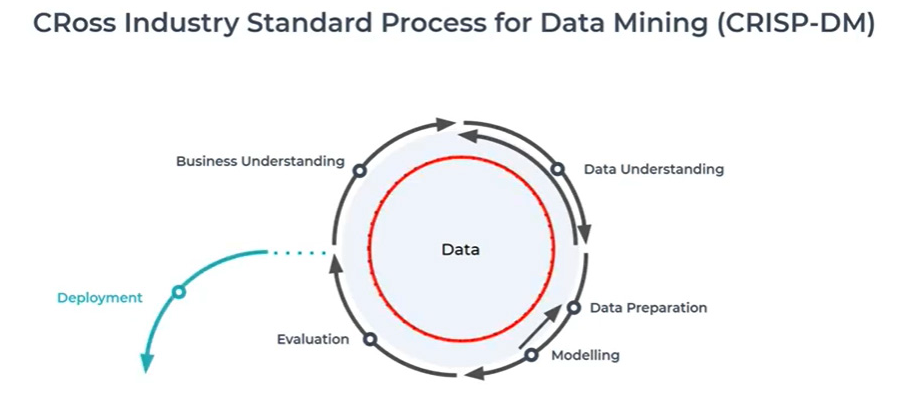

## Jupyter Notebooks Workflow Process

Three Jupyter Notebooks were created and worked through in order for 3 main stages of the project: Data Collection, Data Visualisation, and Data Modelling and Evaluation:

1. **Data Collection** - In this notebook, the data was downloaded into the workspace through Kaggle. Here it was cleaned to remove any non-image files, and then split using the train, test, validation method. The data was split 70% into train, 20% in test, and 10% into validation, which can be seen on a pie chart in the dashboard 'ML Performance Metrics' page. These 3 new folders were saved directly to the inputs folder in the workspace workspace from the Jupyter Notebook.
2. **Data Visualisation** - This notebook included the initial mapping of image sizes. This chart can be seen in the 'Cherry Leaf Visualiser' page of the dashboard. It also included functions to plot mean and variability of images per label, and difference between average image per label. These visualisations were saved into the outputs folder, and can be seen on the dashboard visualisations page. An image montage was also created here, to iterate over images of a given label in the dashboard for the user to see. 
3. **Data Modelling and Evaluation** - The third notebook included the data modelling process. Images were first augmented to alterr existing images from the dataset with rotation, shear, opacity, and rescaling, in order to train the model to make more accurate predictions on unseen data. A sequential tensorflow model was created for the pipeline, and the model was fit to the train set. Model performance (evaluation and accuracy) was also evaluated, which can be seen on the 'ML Performance Metrics' page of the dashboard. The model is **over 97% accurate**, so meets the requirements of the client.

---

# Dashboard Design & App Features

As Streamlit was adopted as the UI for this project, all pages are automatically fully responsive across a range of screen sizes.

### Project Summary Page

- This is the first page that loads upon entering the app. The user will be able to read a section on the context of the project, the Problem Statement, the Two Business requirements, and the Dataset Source, as well as a link to the Readme file.
  
- The first section is a context box, detailing the uses of cherry leaves, powdery mildew infection, its effects on plants.
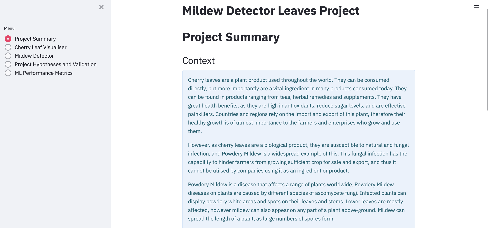

The following section diplays the problem statement. This entails what this project aims to achieve and the problems it will solve for the client.

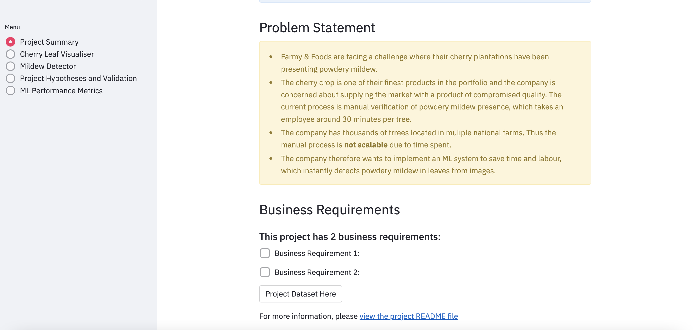

The last section of this page shows checkboxes where users can read the two business requirements when clicked. It also contains a button, where the users can see the link to the dataset when the button is clicked, and a direct link to the project README file.

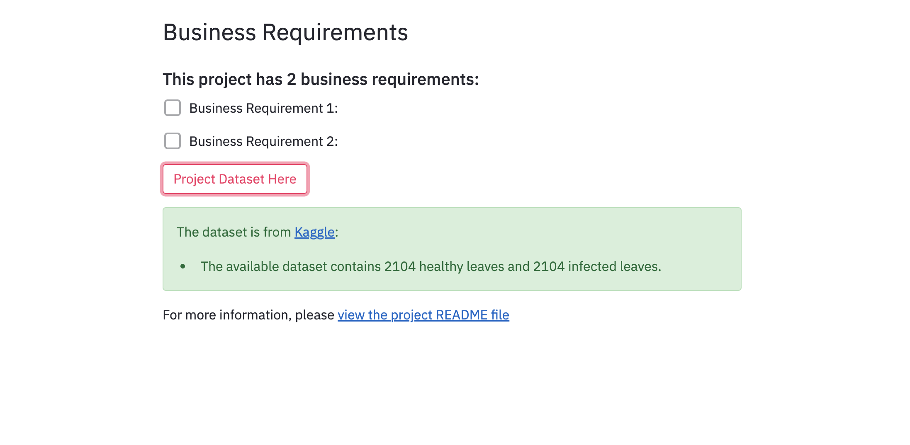

Validation of Business Requirement checkbox functionality:
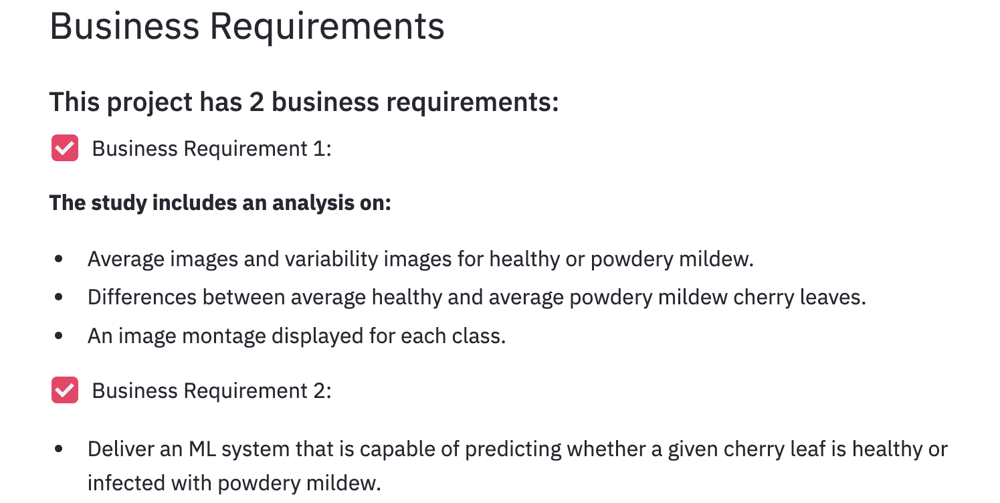

---

### Visualisation Page

This page was built to meet **Business Requirement 1.**

* The user is initially presented with a checkbox. When clicked, they will be presented with a 2x2 grid of images.
* These images display the average and varability images for the two labels (healhy and powdery mildew). 
* Underneath is an information box outlining observations from these images.

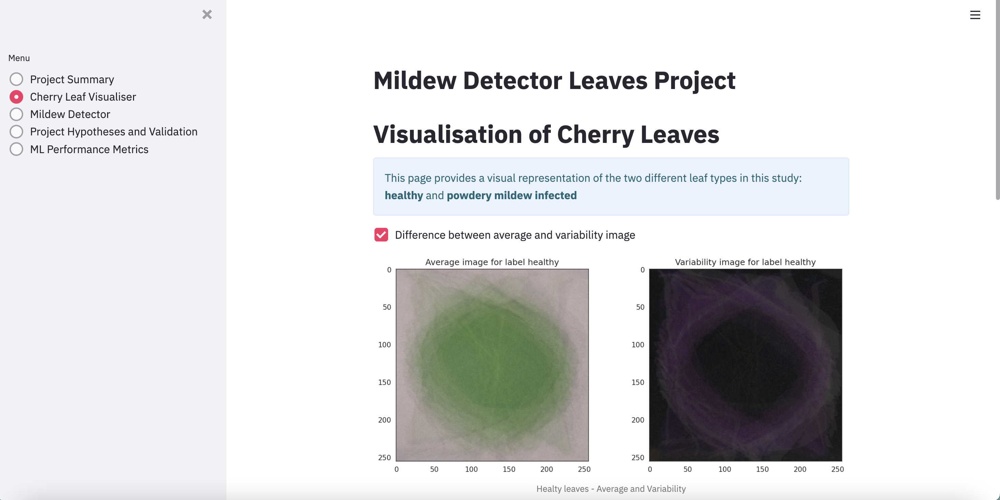

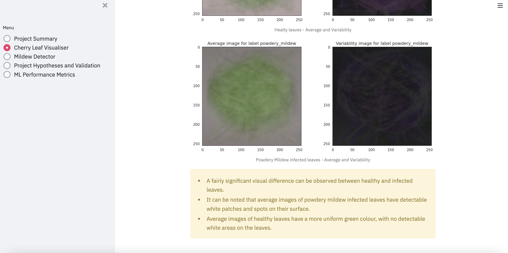

* The user can next see another checkbox. When clicked, this displays a scatterplot of the image sizes on the train set. 
* It shows width and height in pixels on the x and y axis respectively. 
* The caption of this plot also displays the average measurements of the train set images.

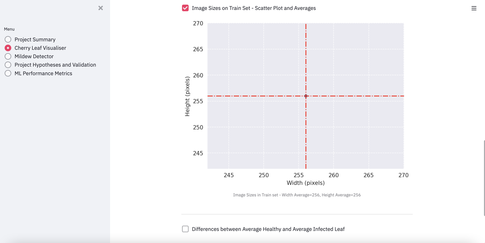

* Underneath is another checkbox. When clicked, the user will see the a row of 3 images, displaying the differences between the average image for the two labels, and a difference image. 
* The purpose of this is to provide a clear visual representation of the difference between a healthy leaf and one infected with powdery mildew.
* There is also an information box outlining observations and visual differences between the average images of the different labels. 

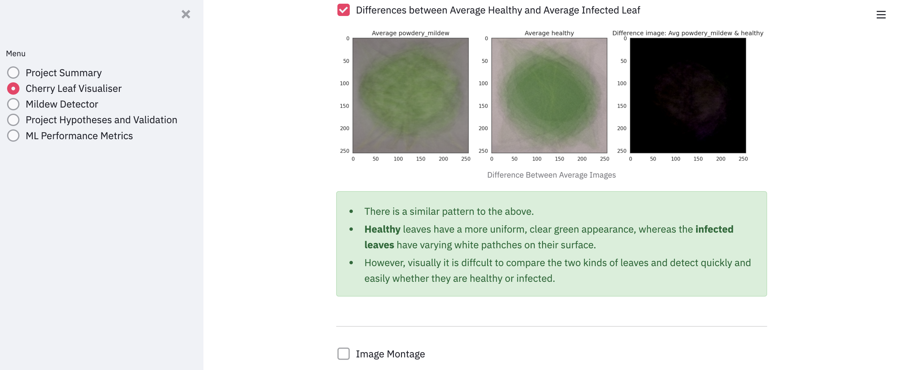

* Lastly on this page is a checkbox for the image montage. When clicked, the user is presented with instructions ho how to create a montage. 
* The user must select to create an image of either healthy or powdery mildew labelled cherry leaves (from the validation set).
* Once they have chosen a label, when the 'Create Montage' button is clicked, a montage of images from the selected label is generated. 
* The purpose of this is for the user to be able to see uniform patterns clearly across leaves of the same type, all at the same time.  
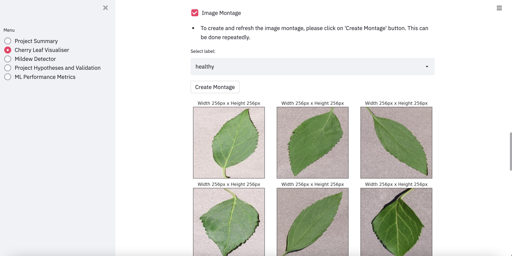

---

### Mildew Detector Page

- This page was built to meet **Business Requirement 2.**
  
This page links to the ML model that has been trained to predict whether a leaf is healthy or infected with powdery midlew, based on a binary classification model.

* The user is presented with an information box with a quick summary of the client interests.
* The link to the dataset is also present, so users can go there to download sample data to insert into the Mildew Detector.
* The user can either drag and drop, or click on the 'Browse files' button so upload images to the Mildew Detector.
* Users may upload single or multiple image files at once. 

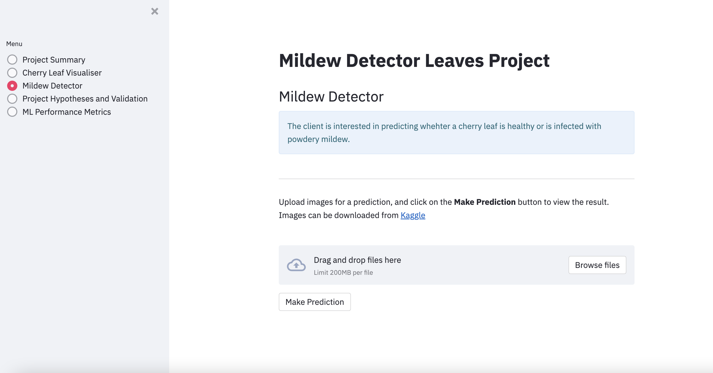

* Once uploaded, an image name(s), file size and file type will show. 
* The user can now click on the 'Make Prediction' button, which runs the model over the image(s) uploaded. 
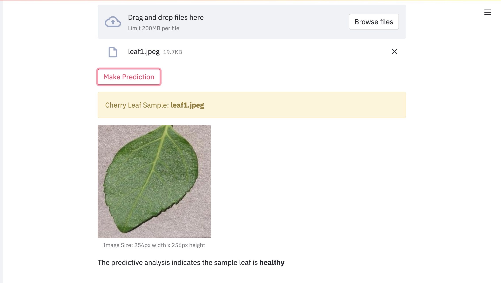

* The user will again see each image file name in a yellow box, and underneath, the prediction of whether it is healthy or infected with powdery mildew.
* A probablility chart will show for each image uploaded, displaying 2 bars representing the probability of the outcome of the prediction. 
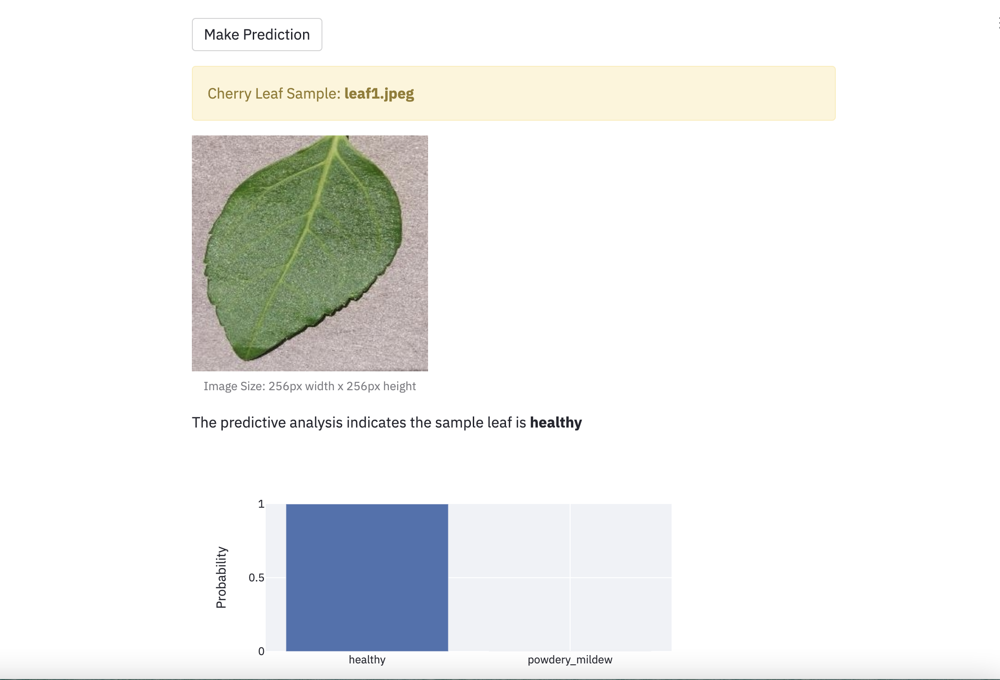
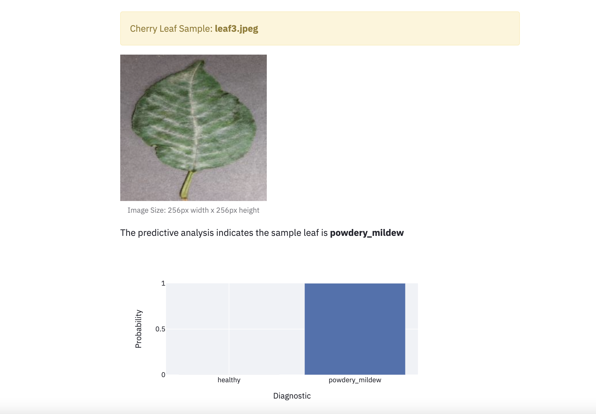

* A user can upload multiple image files at once to save time. In this instance, they will be shown all image file names, then can click 'Make Prediction'. The app will run over each image and display the results for each one individually, as seen above. 
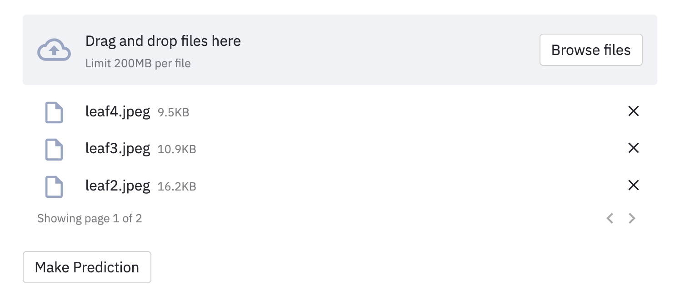

* At the end of a prediction, there is an analysis report generated, which is available for the user to download.
* This report displays the results of all image files uploaded in an individual instance. 
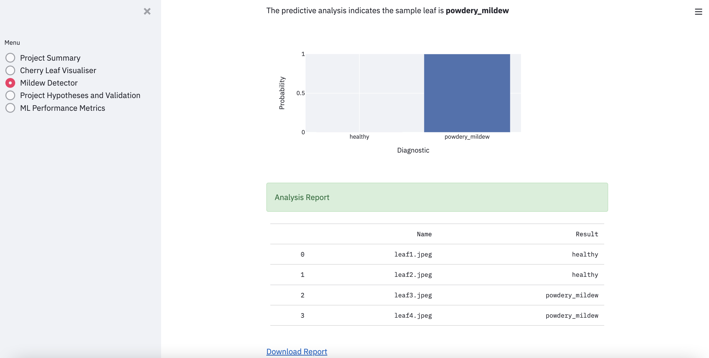

---
### Project Hypotheses and Validation Page

The user can view the project Hypotheses in the first section of this page, and the validation of these in the section underneath.
This page is purely text, so there are no user actions to test/validate. 

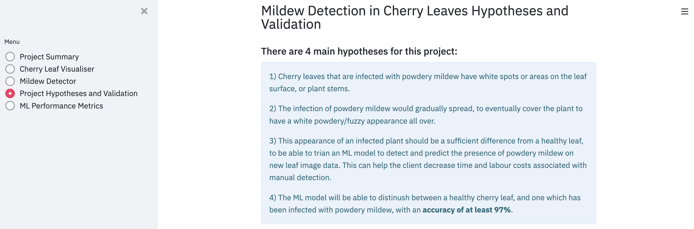

---
### ML Performance Metrics Page

- On this page, the user can see the dataset split metrics, as well as the performance metrics and evaluation of the model, its training history, and loss and accuracy.

The first chart to view is the labels frequency across the train, test, and validation sets, as a bar chart. 
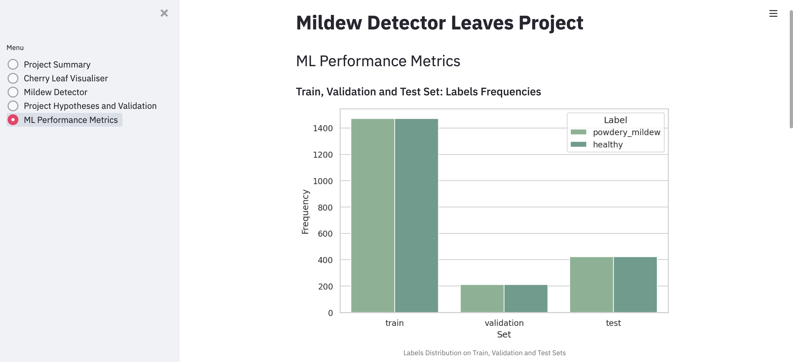

Under this, the user can see a pie chart of the overall ratio of the train, test, and validation sets across the dataset. 

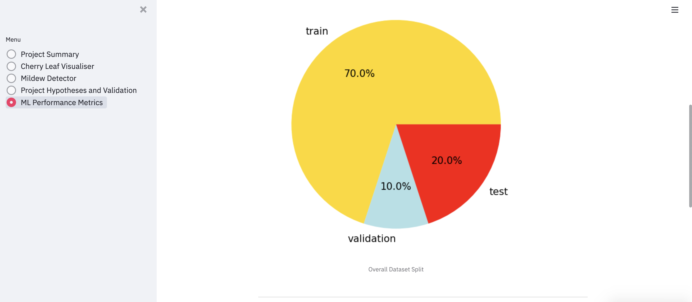

Further down, there are two graphs displaying the model training history. The user can see a graph representing the model training accuracy across the train and validation sets.

The user can also view a graph respresenting the model loss over time. It can be ascertained through these two graphs that the model neither overfit nor underfit. and they follow normal training trajectories.

Finally, under the two graphs is an evaluation of the generalised performance on the test set. This displays a Data Frame showing a loss of 0.0204, and an accuracy of 0.9917 (99%).

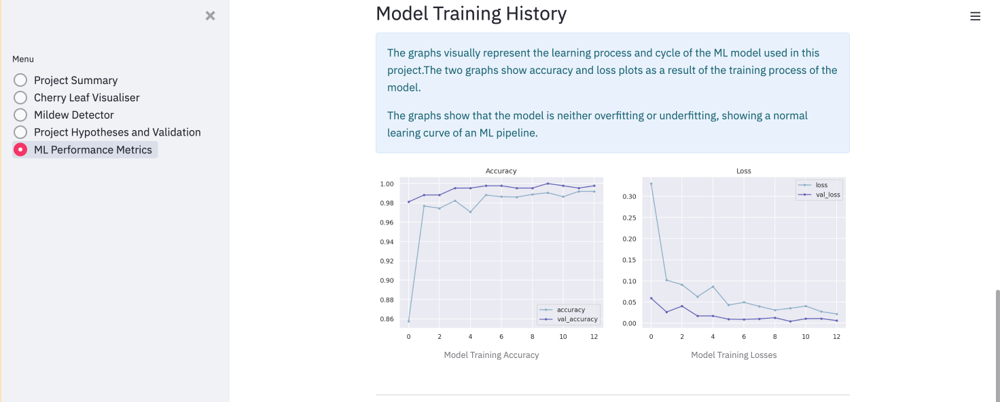
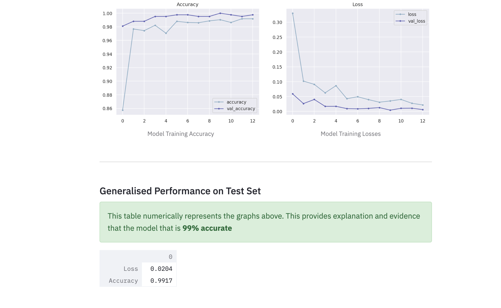

---

# Technologies Used

### Languages

- [Python](https://www.python.org/)

### Data Analysis & Machine Learning Libraries 

- [Pandas](https://pandas.pydata.org/) - Used for data structuring and analysis.
- [Numpy](https://numpy.org/) - Provides mathematical functions to operate with and manipulate arrays.
- [Matplotlib](https://matplotlib.org/) - Used for data visualisation.
- [Seaborn](https://seaborn.pydata.org/#) - Used for statistical graphics, and the stuling of these using themes. 
- [Plotly](https://plotly.com/python/) - Used for plotting data and functions. 
- [Scikit-learn](https://scikit-learn.org/stable/index.html#) - Adopted tools for data processing and predictive analysis. used in this project speicicifically top train the ML Model for the binary classification output. 
- [Tensorflow](https://www.tensorflow.org/) - Used to process and clean the data to search for non-image files. 
- [Keras](https://keras.io/) - Used for the Classification model, and ML pipeline. The neural learning multi-layer network was built using Keras. 
- [Joblib](https://joblib.readthedocs.io/en/latest/) - Used for loading and saving files generated in the project. 
* [Pillow](https://pypi.org/project/Pillow/) - Python Imaging Library used for supporting opening, saving, and manipulating different images with its processing capabilities. 

### Version Control 

- Git - Used as a version control for this project. 
- [GitHub](https://github.com/) - The project repository stored here. 

### Development & Hosting

- [Jupyter Notebooks](https://jupyter.org/) - The main development source for running and executing the ML pipelines. 
- [Codeanywhere](https://codeanywhere.com/) - Used as the workspace and development environment for this project. 
- [Streamlit](https://streamlit.io/) - UI host for the dashboard.
- [Heroku](https://www.heroku.com/) - Used to deploy the project.

## Known/Unfixed Bugs

* The default stack on Heroku is 22. However this stack does not support the Python version used for the development of this project, so I manually changed the Heroku stack to **20**, using the Heroku CLI. 
* Some files were added to the .slugignore file, in order to build the app in Heroku successfully and keep in line with file size restrictions.

---
## Deployment

### Heroku

* The App live link is: https://mildew-detector-cherry-leaves-7ca9c643cfca.herokuapp.com/ 
* Set the runtime.txt Python version to a [Heroku-20](https://devcenter.heroku.com/articles/python-support#supported-runtimes) stack currently supported version.
  
The project was deployed to **Heroku** using the following steps:

1. Log in to Heroku and create a new App
2. At the Deploy tab, select GitHub as the deployment method.
3. Select your repository name and click Search. Once it is found, click Connect.
4. Select the branch you want to deploy, then click Deploy Branch.
5. The deployment process should happen smoothly if all deployment files are fully functional. Click now the button Open App on the top of the page to access your App.
6. If the slug size is too large to build the app, then add large files not required for the app to the .slugignore file. 

---

## Credits 

Learning and assistance for this project came in two categories - **content and media**:
  
### Content

* [Code Institute Malaria Walkthrough Project](https://learn.codeinstitute.net/courses/course-v1:code_institute+CI_DA_ML+2021_Q4/courseware/07a3964f7a72407ea3e073542a2955bd/29ae4b4c67ed45a8a97bb9f4dcfa714b/): The Code and design for this project was largely taken from this Malaria Detector walkthrough project. There are only minor changes from this project to the Mildew Detector. The code in the Malaria Detector was used heavily for guidance and reference in the Jupyter Notebooks, the app pages, and the src folders of this project (including pages within these folders). The Malaria Detector project helped me to understand the concept of Machine Learning, Data Analytics, and Data Visualisation. More specifically, it aided my grasp of a real-world business driven data project, and using neural networks for a binary classification task. 
* [Mildew Detection](https://github.com/Code-Institute-Solutions/milestone-project-mildew-detection-in-cherry-leaves) was utilised as the base template for this project.
* [Streamlit Documentation](https://docs.streamlit.io/)
* [Code Institute Streamlit Lessons](https://learn.codeinstitute.net/courses/course-v1:code_institute+CI_DA_ML+2021_Q4/courseware/d186ae95191f48e9a2151559c7e6f85d/fc2f9892cfa44eee9cc8bf585c21df88/4?activate_block_id=block-v1%3Acode_institute%2BCI_DA_ML%2B2021_Q4%2Btype%40vertical%2Bblock%407636b337caeb4035bd7b5568404802f6)
* Information for the text content for the 'Context' section on the Project Summary page came from [Wikipedia](https://en.wikipedia.org/wiki/Powdery_mildew), [RHS](https://www.rhs.org.uk/disease/powdery-mildews), and the [Washington State University  Page on Cherry Powdery Mildew](https://treefruit.wsu.edu/crop-protection/disease-management/cherry-powdery-mildew/). 
* [valerioni/mildew-detection Github Repository](https://github.com/valerieoni/mildew-detection) was used as guidance for the readme.

### Media

* The Images dataset for this project was sourced from [Kaggle](https://www.kaggle.com/datasets/codeinstitute/cherry-leaves).
* The UI for the app has been built using [Streamlit](https://streamlit.io/).

---

## Acknowledgements

* I would like to thank my mentor **Rohit Sharma**, for his time and expert insights provided throughout the duration of this project.  
* **Neil McEwan**, for helping with intial project understanding, and versioning issues with packages. 