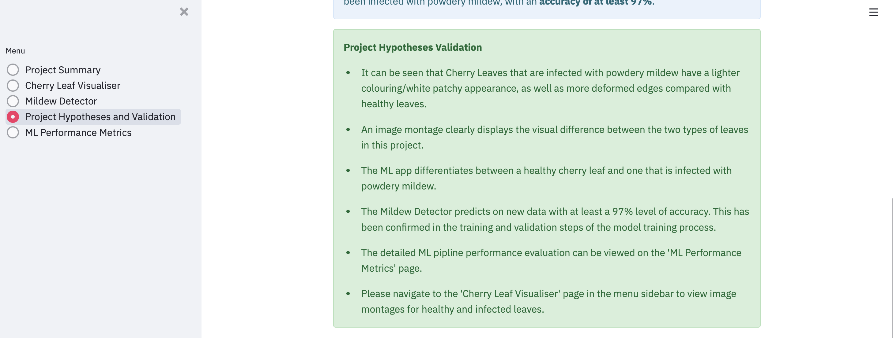

# Mildew Detector Cherry Leaves

Powdery Mildew Detector is an app that can predict whether a cherry leaf is healthy or is infected
with powdery mildew. 
The app is capable of predicting on new image data of a given cherry leaf is healthy or infected.

The app has been built using an ML model based on a supervised learning and single-label binary classification. 
A binary classifier is been used as the output to predict a result. 

[View the live project here](https://mildew-detector-cherry-leaves-7ca9c643cfca.herokuapp.com/)

---
## Dataset Content

* The source of the dataset is [Kaggle](https://www.kaggle.com/codeinstitute/cherry-leaves). For this project, fictitious user stories and business requirements where predictive analytics can be applied to a real-world workplace project or situation.
* The dataset contains +4 thousand images taken from the client's crop fields. The images show healthy cherry leaves and cherry leaves that have powdery mildew.
* The cherry plantation crop is one of the finest products in their portfolio. Infected cherry leaves contain powdery mildew, which is a fungal disease that affects a widerange of plants. This presents a major problem to the busiess as the disease can severely compromise the product quality and output.

The full dataset can be found [here](https://www.kaggle.com/datasets/codeinstitute/cherry-leaves)

## Business Requirements

- Farmy & Foods is facing a challenge in their main plantation, where their cherry crops have been presenting powdery mildew. Currently, the process is manual verification if a given cherry tree contains powdery mildew. An employee can spend around 30 minutes in each tree, taking a few samples of tree leaves and verifying visually if the leaf tree is healthy or has powdery mildew. If there is powdery mildew, the employee must apply a specific compound to kill the fungus. The time spent applying this compound is 1 minute. The company has thousands of cherry trees, located on multiple farms across the country. As a result, this manual process is not scalable due to the time spent in the manual process inspection.

- To increase efficiency in this process, the IT team suggested an ML system that detects instantly, using a leaf tree image, if it is healthy or has powdery mildew. A similar manual process is in place for other crops for detecting pests, and if this initiative is successful, there is a realistic opportunity to replicate this project for all other crops to further improve business processes. 
- The dataset is a collection of cherry leaf images provided by the client, taken from their crops.

**Therefore, the client is interested in developing an app that has the capability to:**

* 1 - Visually differentiate a healthy cherry leaf from one with powdery mildew.
* 2 - Predict if a cherry leaf is healthy or contains powdery mildew.

## Hypotheses and Validation

1.  Cherry leaves that are infected with powdery mildew have white spots or areas on the leaf surface, or plant stems.
2. The infection of powdery mildew would gradually spread, to eventually cover the plant to have a white powdery/fuzzy appearance all over.
3. This appearance of an infected plant should be a sufficient difference from a healthy leaf, to be able to trian an ML model to detect and predict the presence of powdery mildew on new leaf image data. This can help the client decrease time and labour costs associated with manual detection.
4. The ML model will be able to distinush between a healthy cherry leaf, and one which has been infected with powdery mildew, with an **accuracy of at least 97%.**

## Rationale to map the business requirements to the Data Visualisations and ML tasks

### Business Requiment 1: Data Visualisation

### Business Requirement 2: Classification of Images 

## ML Business Case
* In the previous bullet, you potentially visualised an ML task to answer a business requirement. You should frame the business case using the method we covered in the course.

## Project Methodologies

- This project was developed using agile methodologies, adopting Github **Issues** and **Projects**. This was to track the 
continuous progress of the development of the project, as well as giving issues metadata, such as work blocks, and prioritisation of features. 
- The Project Kanban board can be found [here](https://github.com/users/georgiagrayland/projects/4)

### CRISP-DM
- The CRISP-DM method is an industry-proved method and guide to manage data mining efforts. 
  - As a methodology, it includedsdescriptions of project phases, individidual tasks involved at each stage, and also a mapping and explanation of the links, flows, and relationships between these tasks.
  - The CRISP-DM model provides an overview of the life cycle of data mining, And was used as a reference throughout this project to maintain workflow, task management, time management, and connecting hypothesis and data model to the business requirements. 
#### CRISP-DM Workflow

## Jupyter Notebooks Process

## Dashboard Design & App Features

- As Streamlit was adopted as the UI for this project, all pages are automatically fully responsive across a range of screen sizes.

### Project Summary Page

- Insert tests/explanation

### Visualisation Page
- Meets Business Requirement 1

### Mildew Detector Page
- Meets Business Requirement 2

### Project Hypotheses and Validation Page

### ML Performance Metrics Page

- Insert explanation of page

---
## Technologies Used

### Languages
- [Python](https://www.python.org/)

### Data Analysis & Machine Learning Libraries 
- [Pandas](https://pandas.pydata.org/) - Used for data structuring and analysis.
- [Numpy](https://numpy.org/) - Provides mathematical functions to operate with and manipulate arrays.
- [Matplotlib](https://matplotlib.org/) - Used for data visualisation.
- [Seaborn](https://seaborn.pydata.org/#) - Used for statistical graphics, and the stuling of these using themes. 
- [Plotly](https://plotly.com/python/) - Used for plotting data and functions. 
- [Scikit-learn](https://scikit-learn.org/stable/index.html#) - Adopted tools for data processing and predictive analysis. used in this project speicicifically top train the ML Model for the binary classification output. 
- [Tensorflow](https://www.tensorflow.org/) - Used to process and clean the data to search for non-image files. 
- [Keras](https://keras.io/) - Used for the Classification model, and ML pipeline. The neural learning multi-layer network was built using Keras. 
- [Joblib](https://joblib.readthedocs.io/en/latest/) - Used for loading and saving files generated in the project. 
* [Pillow](https://pypi.org/project/Pillow/) - Python Imaging Library used for supporting opening, saving, and manipulating different images with iss processing capabilities. 

### Version Control 
- Git - Used as a version control for this project. 
- [GitHub](https://github.com/) - The project repository stored here. 

### Development & Hosting
- [Jupyter Notebooks](https://jupyter.org/) - the main development source for running and executing the ML pipelines. 
- [Codeanywhere](https://codeanywhere.com/) - Used as the workspace and development environment for this project. 
- [Streamlit](https://streamlit.io/) - UI host for the dashboard.
- [Heroku](https://www.heroku.com/) - Used to deploy the project. 

## Unfixed Bugs
* The default stack on Heroku is 22. However this stack does not support the Python version used for the development of this project, so I manually changed the Heroku stack to **20**, using the Heroku CLI. 
* Some files were added to the .slugignore file, in order to build the app in Heroku successfully and keep in line with file size restrictions. 

---
## Deployment
### Heroku

* The App live link is: https://mildew-detector-cherry-leaves-7ca9c643cfca.herokuapp.com/ 
* Set the runtime.txt Python version to a [Heroku-20](https://devcenter.heroku.com/articles/python-support#supported-runtimes) stack currently supported version.
  
The project was deployed to **Heroku** using the following steps:

1. Log in to Heroku and create a new App
2. At the Deploy tab, select GitHub as the deployment method.
3. Select your repository name and click Search. Once it is found, click Connect.
4. Select the branch you want to deploy, then click Deploy Branch.
5. The deployment process should happen smoothly if all deployment files are fully functional. Click now the button Open App on the top of the page to access your App.
6. If the slug size is too large to build the app, then add large files not required for the app to the .slugignore file. 

---
## Credits 

Learning and assistance for this project came in two categories **content and media/data**: 
  
### Content 

- [Code Institute Malaria Walkthrough Project](https://learn.codeinstitute.net/courses/course-v1:code_institute+CI_DA_ML+2021_Q4/courseware/07a3964f7a72407ea3e073542a2955bd/29ae4b4c67ed45a8a97bb9f4dcfa714b/): The Code and design for this project was taken from this Malaria Detector walkthrough project. There are only minor changes from this project to the Mildew Detector. The code in the Malaria Detector was used heavily for guidance and reference in the Jupyter Notebooks, the app pages, and the src folders of this project (including pages within these folders). The Malaria Detector project helped me to understand the concept of Machine Learning, Data Analytics, and Data Visualisation. More specifically, it aided my grasp of a real-world business driven data project, and using neural networks for a binary classification task. 
- [Mildew Detection](https://github.com/Code-Institute-Solutions/milestone-project-mildew-detection-in-cherry-leaves) was utilised as the base foundation template for this project. 
- [Streamlit Documentation](https://docs.streamlit.io/)
- [Code Institute Streamlit Lessons](https://learn.codeinstitute.net/courses/course-v1:code_institute+CI_DA_ML+2021_Q4/courseware/d186ae95191f48e9a2151559c7e6f85d/fc2f9892cfa44eee9cc8bf585c21df88/4?activate_block_id=block-v1%3Acode_institute%2BCI_DA_ML%2B2021_Q4%2Btype%40vertical%2Bblock%407636b337caeb4035bd7b5568404802f6)
- Information for the text content for the 'Context' section on the Project Summary page came from [Wikipedia](https://en.wikipedia.org/wiki/Powdery_mildew), [RHS](https://www.rhs.org.uk/disease/powdery-mildews), and the [Washington State University  Page on Cherry Powdery Mildew](https://treefruit.wsu.edu/crop-protection/disease-management/cherry-powdery-mildew/). 
- [valerioni/mildew-detection Github Repository](https://github.com/valerieoni/mildew-detection) was used as guidance for the readme. 

### Media

- The Images dataset for this project was sourced from [Kaggle](https://www.kaggle.com/datasets/codeinstitute/cherry-leaves)
- The UI for the app has been built using [Streamlit](https://streamlit.io/)

## Acknowledgements
* I would like to thank my mentor **Rohit Sharma**, for his time and expert insights provided throughout the duration of this project.  
* **Neil MCEwan**, for helping with intial project understanding, and versioning issues with packages. 